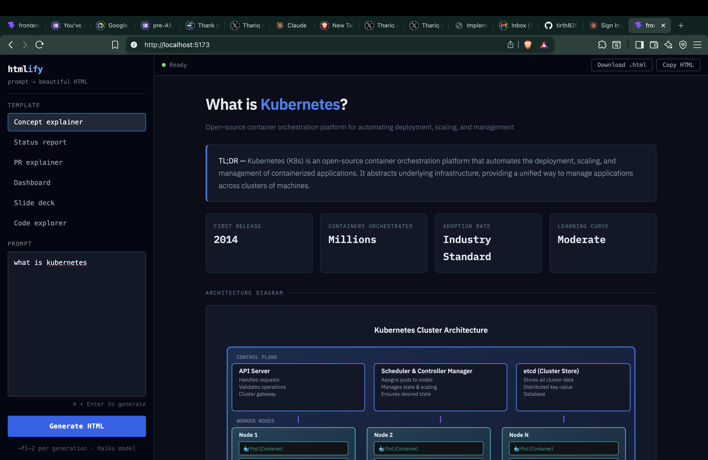
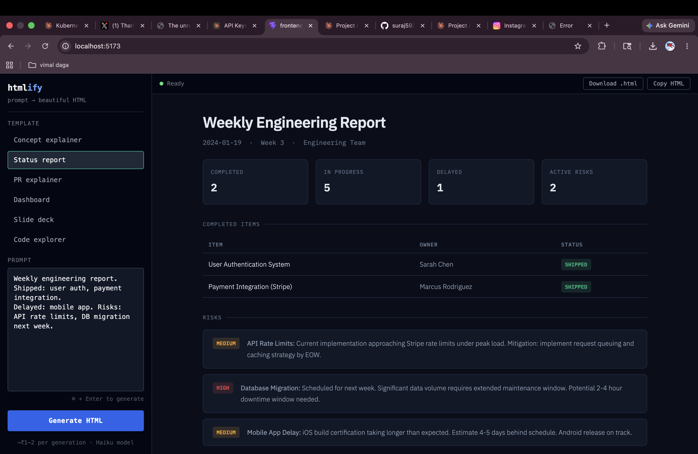
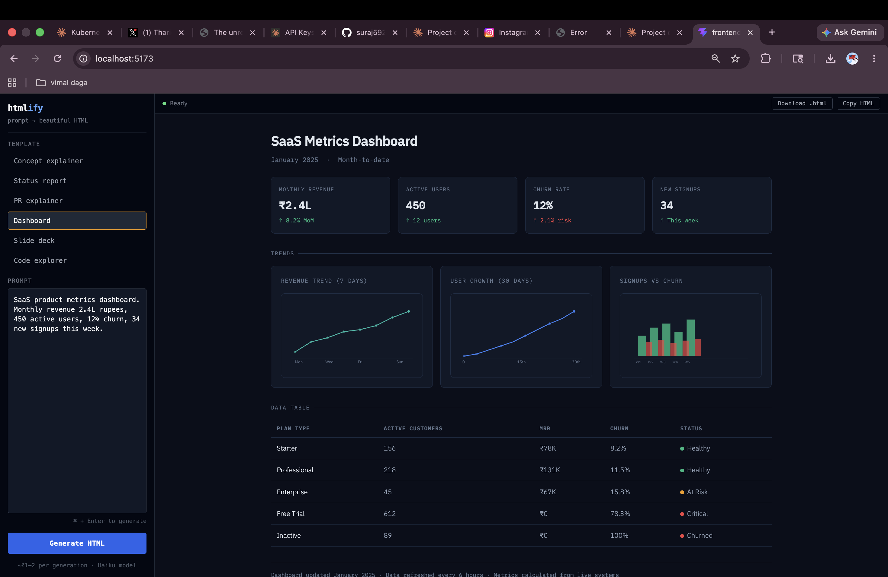
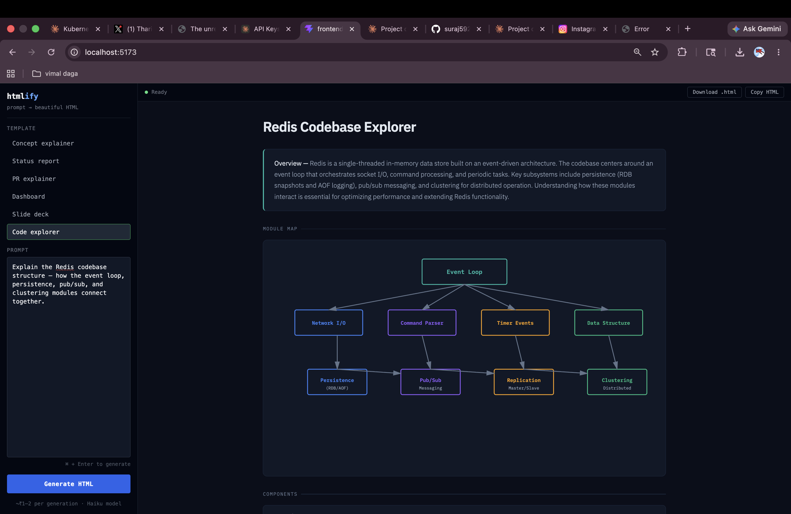
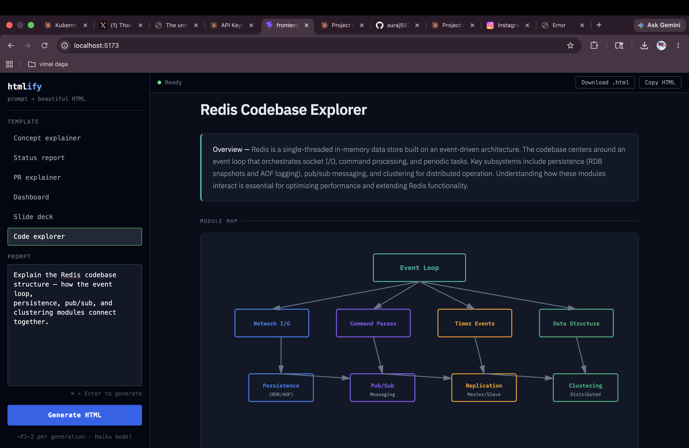
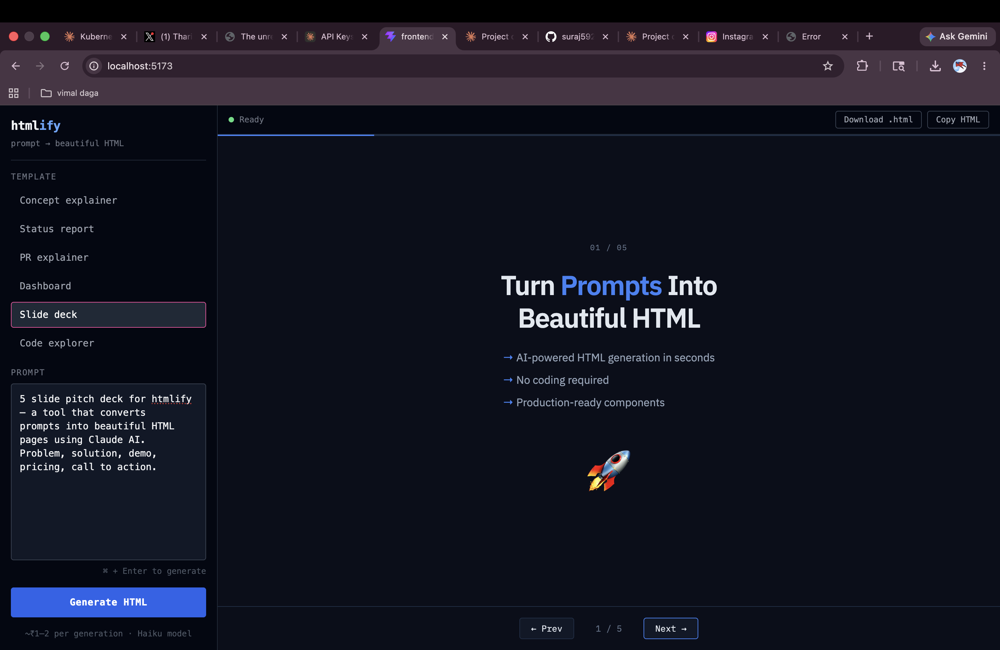
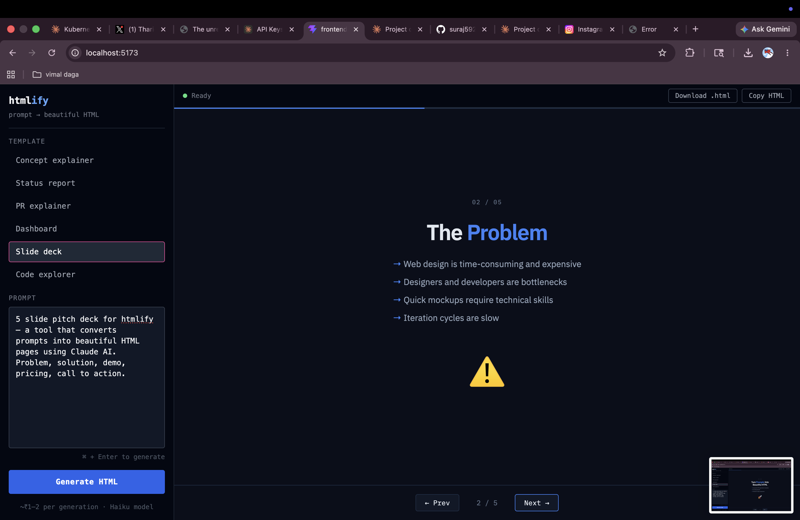
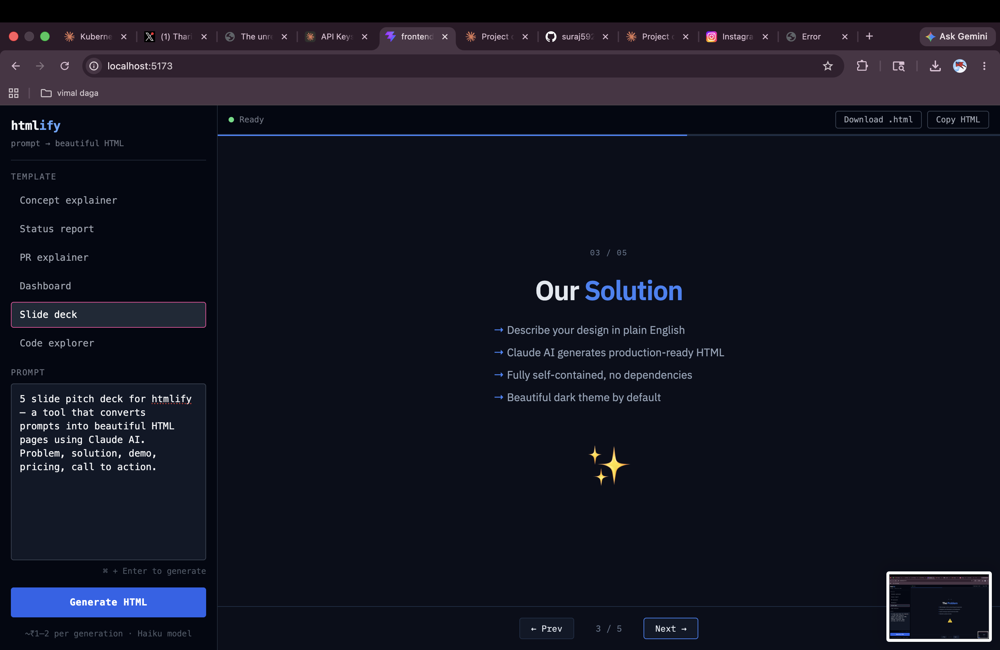
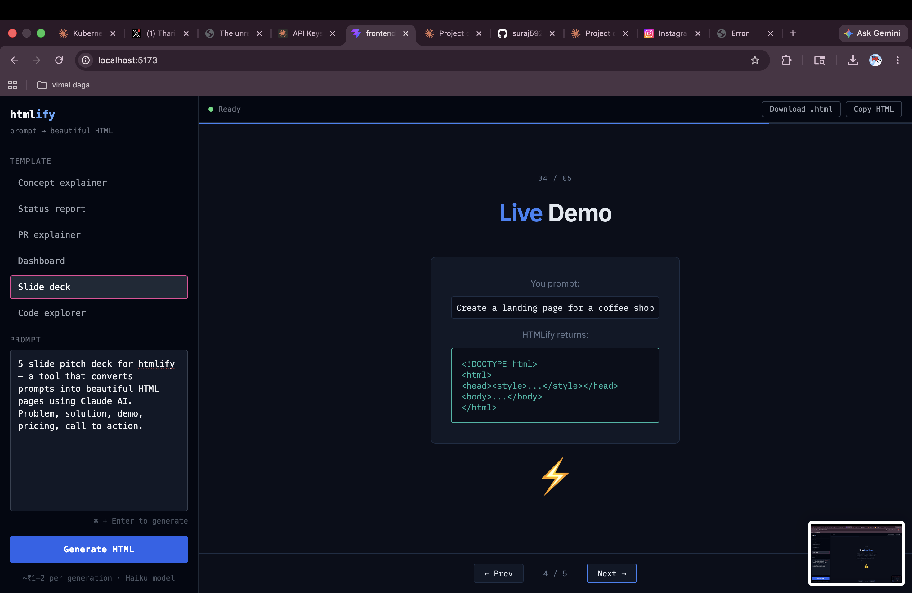
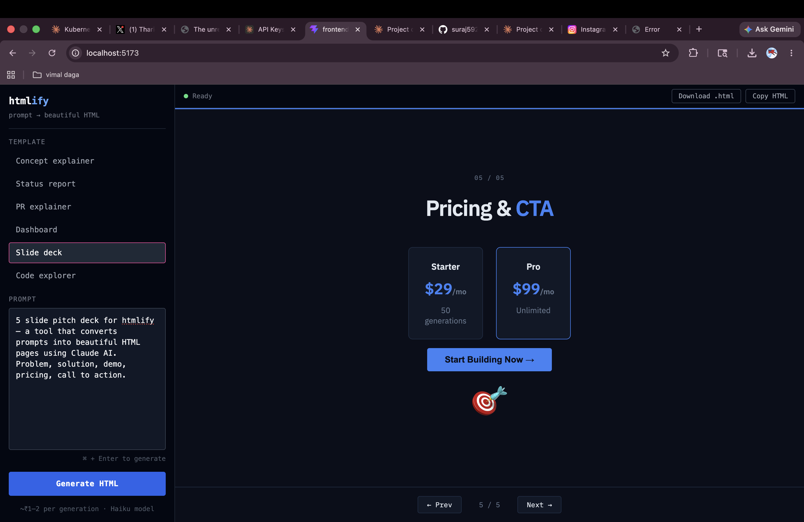

# html**ify**

> **prompt → beautiful HTML** — Turn any description into a stunning, self-contained HTML page using Claude AI. No design skills required.

---

## What is htmlify?

htmlify is a local tool that takes a plain-English prompt and streams back a complete, production-quality HTML file — ready to share with a manager, client, or team. Every output is fully self-contained: no frameworks, no CDN dependencies, just a single `.html` file you can open anywhere.

It uses **Claude Haiku** (Anthropic's fastest model) with **HTML skeleton templates** to keep generation fast and cost under ₹1–2 per page.

---

## Screenshots

### Concept Explainer — "What is Kubernetes?"
Generates a full explainer with TL;DR summary, metric cards, architecture diagram, step-by-step flow, concept cards, and a code example.



---

### Status Report — Weekly Engineering Report
Produces a professional status report with shipped/delayed/risk metrics, a completed-items table, colour-coded risk badges (High / Medium / Low), and a timeline.



---

### Dashboard — SaaS Metrics
Renders a data dashboard with KPI cards (revenue, users, churn, signups), trend charts, and a colour-coded data table with plan-level breakdown.



---

### Code Explorer — Redis Codebase
Creates an interactive explorer with an overview card, a module map showing how components connect (Event Loop → Network I/O → Persistence → Clustering), expandable accordion sections, and a glossary.





---

### Slide Deck — 5-Slide Pitch Deck
Builds a fully navigable slide deck (arrow keys or Prev/Next buttons) with a progress bar. Each slide has a tag, title, bullet points, and a visual.

| Slide 1 — Intro | Slide 2 — Problem |
|---|---|
|  |  |

| Slide 3 — Solution | Slide 4 — Live Demo |
|---|---|
|  |  |

| Slide 5 — Pricing & CTA |
|---|
|  |

---

## Templates

| Template | What it generates |
|---|---|
| **Concept explainer** | TL;DR card, metrics, flow steps, concept cards, code example |
| **Status report** | Metrics, completed table, risk badges (green/amber/red), timeline |
| **PR explainer** | Diff view, file changes, inline annotations, risk badge |
| **Dashboard** | KPI cards with deltas, bar charts, colour-coded data table |
| **Slide deck** | 5–7 arrow-key navigable slides with progress bar |
| **Code explorer** | Module map, interactive accordion, glossary |

---

## Tech Stack

| Layer | Technology |
|---|---|
| Frontend | React + Vite + Tailwind CSS v3 |
| Backend | Python + Flask |
| AI | Claude Haiku (`claude-haiku-4-5`) via Anthropic Python SDK |
| Streaming | Server-Sent Events (SSE) |
| Templates | Pre-built HTML skeletons (saves 60–70% output tokens) |

---

## Project Structure

```
htmlify/
├── frontend/               ← React app (Vite + Tailwind)
│   └── src/
│       ├── App.jsx
│       └── components/
│           ├── PromptPanel.jsx
│           └── PreviewPanel.jsx
├── backend/                ← Python Flask API server
│   ├── app.py              ← Flask app entry point
│   ├── requirements.txt    ← Python dependencies
│   ├── routes/
│   │   └── generate.py     ← SSE streaming route (Blueprint)
│   └── prompts/
│       └── __init__.py     ← System + user prompt builders
└── templates/              ← HTML skeletons (token optimization)
    ├── explainer.html
    ├── report.html
    ├── pr.html
    ├── dashboard.html
    ├── slideshow.html
    └── explorer.html
```

---

## Getting Started

### 1. Clone the repo

```bash
git clone https://github.com/suraj5929/htmlify.git
cd htmlify
```

### 2. Set up the backend

```bash
cd backend

# Create and activate a virtual environment
python3 -m venv venv
source venv/bin/activate        # macOS / Linux
# venv\Scripts\activate         # Windows

# Install dependencies
pip install -r requirements.txt
```

### 3. Add your API key

Create `backend/.env`:

```bash
ANTHROPIC_API_KEY=sk-ant-your-key-here
PORT=3001
```

Get your key at [console.anthropic.com](https://console.anthropic.com).

### 4. Set up the frontend

```bash
cd frontend
npm install
```

### 5. Run

```bash
# Terminal 1 — backend (from backend/ with venv active)
source venv/bin/activate
python3 app.py

# Terminal 2 — frontend
cd frontend && npm run dev
```

Open **http://localhost:5173**, pick a template, write a prompt, click **Generate HTML**.

---

## How It Works

1. You pick a template and write a prompt in the left panel
2. Frontend sends a `POST /api/generate` request to the Flask backend
3. Backend calls Claude Haiku with the system prompt + skeleton template + your prompt
4. Claude streams back HTML via Server-Sent Events (SSE)
5. The iframe in the preview panel updates live as HTML arrives
6. Download the finished page as a `.html` file — fully self-contained

---

## Cost

| Method | Output tokens | Cost per request |
|---|---|---|
| Full generation (no skeleton) | ~7,000 | ~₹8–10 |
| With skeleton templates | ~2,000–3,000 | ~₹1–2 |

Prompt caching is enabled on the system prompt — repeat requests within 5 minutes cost ~90% less on input tokens.

---

## License

MIT
